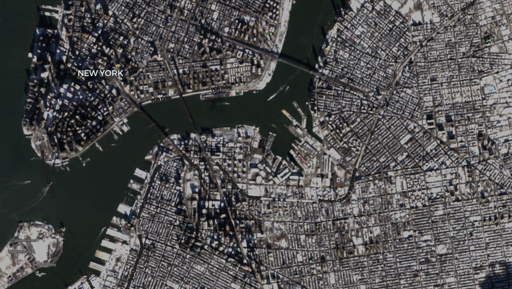
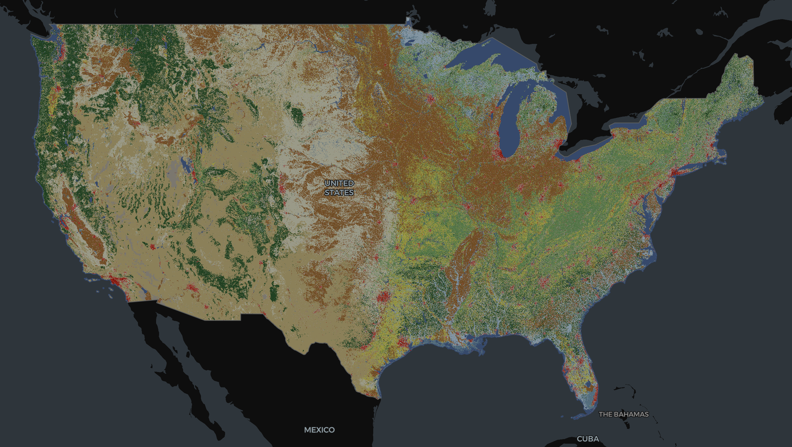
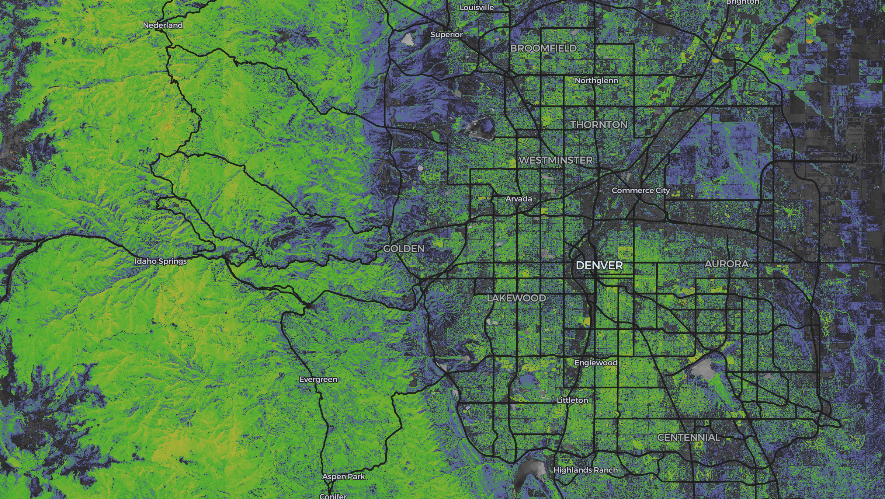
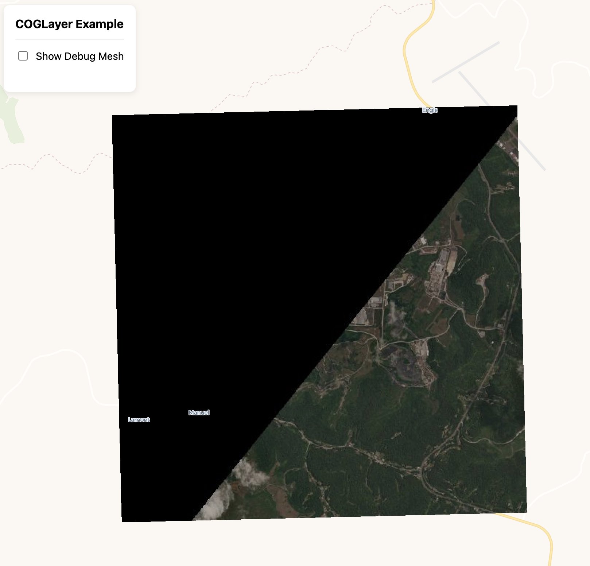
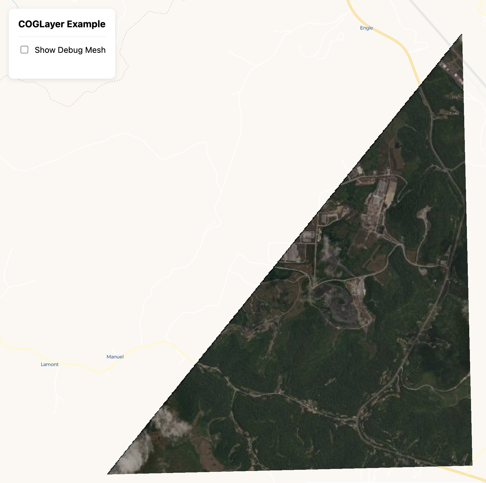

deck.gl-raster is enabling GPU-accelerated [GeoTIFF][geotiff] and [Cloud-Optimized GeoTIFF][cogeo] (COG) visualization in [deck.gl].

[geotiff]: https://en.wikipedia.org/wiki/GeoTIFF
[cogeo]: https://cogeo.org/
[deck.gl]: https://deck.gl/

Here's what's new in v0.3.

<!-- truncate -->

## Updated Examples

We have a new [examples](https://developmentseed.org/deck.gl-raster/examples/) page in the documentation, where we'll continue adding examples.

| Example | |
| -- | -- |
| RGB Cloud-Optimized GeoTIFF | [](https://developmentseed.org/deck.gl-raster/examples/cog-basic/) |
| NLCD Land Cover | [](https://developmentseed.org/deck.gl-raster/examples/land-cover/) |
| NAIP Planetary Computer Mosaic | [](https://developmentseed.org/deck.gl-raster/examples/naip-mosaic/) |

## New TypeScript GeoTIFF reader for the web

We're releasing [`@developmentseed/geotiff`], a new, high-level, full-TypeScript GeoTIFF and [Cloud-Optimized GeoTIFF] (COG) reader for the browser, built on top of [`@cogeotiff/core`].

[`@developmentseed/geotiff`]: https://developmentseed.org/deck.gl-raster/api/geotiff/
[Cloud-Optimized GeoTIFF]: https://cogeo.org/
[`@cogeotiff/core`]: https://github.com/blacha/cogeotiff

This includes a number of features:

- **Full TypeScript**: The entire project — both public APIs and internal code — is strongly and exhaustively typed in TypeScript.
- **No unnecessary data copies**: Image fetching APIs always return data in their original layout, ensuring data copies only happen with the user's explicit consent.
- **Easy access to image tiles**: `GeoTIFF.fetchTile` fetches individual tiles from the source GeoTIFF or COG.

    A single call to `fetchTile` ensures that there is always **one** request to the backend COG for the given tile, ensuring network calls are predictable.
- **Convenient access to reduced-resolution overviews**: Easily access reduced-resolution overviews to fetch tiles at your desired resolution.
- **Affine transformation handling**: Integrates with the new [`@developmentseed/affine`] for easy handling of image transforms, associating pixel positions to spatial coordinates.

    All loaded [`RasterArray`] instances contain an [`Affine`], tracking the relative image transform of that specific image window.
- **Automatic Nodata Mask handling**: nodata masks are automatically associated with their related image data, and are automatically fetched when available.
- **Configurable Web Worker pool** for image decoding off the main thread.
- **Full user control over caching and chunking**
- **Nearly-identical API to Python's [`async-geotiff`]** useful for building GeoTIFF image handling across both TypeScript and Python.

[`async-geotiff`]: https://github.com/developmentseed/async-geotiff
[`RasterArray`]: https://developmentseed.org/deck.gl-raster/api/geotiff/type-aliases/RasterArray/
[`Affine`]: https://developmentseed.org/deck.gl-raster/api/affine/type-aliases/Affine/
[`@developmentseed/affine`]: https://developmentseed.org/deck.gl-raster/api/affine/

### Why not geotiff.js?

The initial implementation of deck.gl-raster used [geotiff.js], and geotiff.js was great for quickly getting started. But as we move towards production stability, there are a few reasons why we built [`@developmentseed/geotiff`].

[geotiff.js]: https://geotiffjs.github.io/

- **Full TypeScript**: The underlying library [`@cogeotiff/core`] is fully typed in expressive TypeScript, making it much more enjoyable to build on top of.

    I tried to submit PRs to move geotiff.js to TypeScript, but contributors there [wished to remain in JavaScript + JSDoc](https://github.com/geotiffjs/geotiff.js/issues/487).

- [`@cogeotiff/core`] implements a bunch of optimizations, like reading [_and utilizing_](https://github.com/blacha/cogeotiff/blob/4781a6375adf419da9f0319d15c8a67284dfb0c4/packages/core/src/tiff.image.ts#L566-L572) the [GDAL "ghost header"](https://gdal.org/en/stable/drivers/raster/cog.html#header-ghost-area) out of the box. In contrast, geotiff.js [can parse](https://github.com/geotiffjs/geotiff.js/blob/ae88c5e8d7b254cdd86d84fcd50254863663980d/src/geotiff.js#L529) but won't automatically use the ghost values.
- **Project scope**: geotiff.js has a _lot_ of code unrelated to the needs of deck.gl-raster. Resampling, tile-merging, conversion to RGB, overview selection based on a target resolution, writing GeoTIFFs. These geotiff.js features are unnecessary for us, but make geotiff.js more complex to maintain if we had to fix something.
- **Confidence to build on top of**: this is subjective, but geotiff.js feels overly complex. It doesn't feel focused on a targeted, clean API in the way that `@cogeotiff/core` is.
- **JSDoc is hard to read and contribute to**: this is subjective, but I find it _much_ harder to read and contribute to geotiff.js code written with [JSDoc](https://jsdoc.app/) instead of pure TypeScript.
- **Code quality**: there are various parts of geotiff.js with code just... [commented out](https://github.com/geotiffjs/geotiff.js/blob/ae88c5e8d7b254cdd86d84fcd50254863663980d/src/geotiffimage.js#L161-L174). And the function has [no documentation](https://github.com/geotiffjs/geotiff.js/blob/ae88c5e8d7b254cdd86d84fcd50254863663980d/src/geotiffimage.js#L100-L110). Why is it normalizing? The [`needsNormalization` function](https://github.com/geotiffjs/geotiff.js/blob/ae88c5e8d7b254cdd86d84fcd50254863663980d/src/geotiffimage.js#L86-L98) also has no documentation, and is hard to understand what the equality is checking because it doesn't use TypeScript-standard enums, which would make the code itself readable.

Overall, geotiff.js seems like a fine library, and it was useful to get started quickly. But to build a modern COG rendering stack, we need to have a huge amount of confidence on our foundations, and `@cogeotiff/core` gives that confidence.

[cogeotiff-lib]: https://github.com/blacha/cogeotiff
[`geotiff.js`]: https://geotiffjs.github.io/

### Integration testing against rasterio

[`@developmentseed/geotiff`] is integration tested against [`rasterio`] for GeoTIFF test cases stored in [`geotiff-test-data`].

[`geotiff-test-data`]: https://github.com/developmentseed/geotiff-test-data
[`rasterio`]: https://rasterio.readthedocs.io/

## Automatic nodata masking in deck.gl-geotiff

In `deck.gl-geotiff`, the [`COGLayer`] will automatically check for and use a nodata mask.

[`COGLayer`]: https://developmentseed.org/deck.gl-raster/api/deck-gl-geotiff/classes/COGLayer/

| Before                                         | After                                      |
| ---------------------------------------------- | ------------------------------------------ |
|  |  |

## New compressed EPSG projection database for the web

We're releasing [`@developmentseed/epsg`]. It ships the full EPSG projection database as WKT2 strings, gzip-compressed to **309kb** for the web.

[`@developmentseed/epsg`]: https://developmentseed.org/deck.gl-raster/api/epsg/

```ts
import loadEPSG from "@developmentseed/epsg/all";
import proj4 from "proj4";

// Load the EPSG database
const epsg = await loadEPSG();

// Access WKT strings by EPSG code.
const wkt4326 = epsg.get(4326);
const wkt3857 = epsg.get(3857);

// Then use proj4.js as normal
const converter = proj4(wkt4326, wkt3857);
const inputPoint = [1, 52];
const outputPoint = converter.forward(inputPoint);
```

This can easily be used outside of deck.gl use cases.

## New port of [`rasterio/affine`]

We're releasing [`@developmentseed/affine`], a port of [`rasterio/affine`] for working with affine image transformations.

```ts
import type { Affine } from "@developmentseed/affine";
import { apply } from "@developmentseed/affine";

const gt: Affine = [1, 0, 10, 0, 1, 20];
const coord = apply(gt, 5, 5);
// [15, 25]
```

This is designed as a collection of lightweight pure functions around an `Affine`, typed as

```ts
export type Affine = readonly [
  a: number,
  b: number,
  c: number,
  d: number,
  e: number,
  f: number,
];
```

This architecture ensures maximum tree-shakability.

[`rasterio/affine`]: https://affine.readthedocs.io/
[`@developmentseed/affine`]: https://developmentseed.org/deck.gl-raster/api/affine/

This is not yet a full port, but we plan to port over more functions as needed.

## New documentation website

We have a new documentation website for deck.gl-raster: [developmentseed.org/deck.gl-raster](https://developmentseed.org/deck.gl-raster/).

This hosts examples and API docs for all modules in this monorepo.
